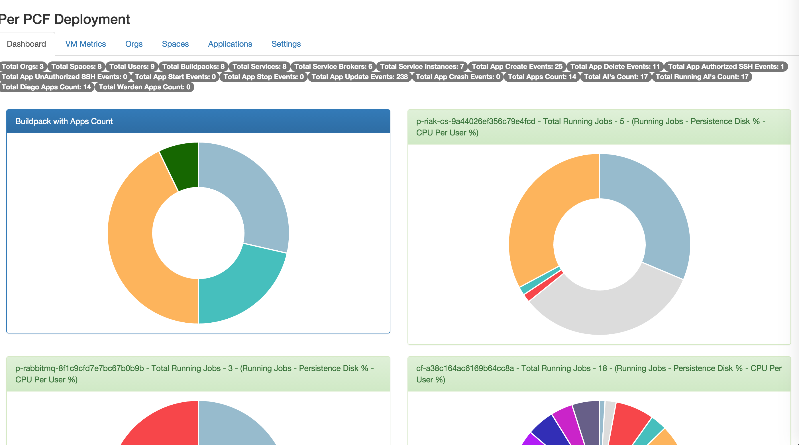
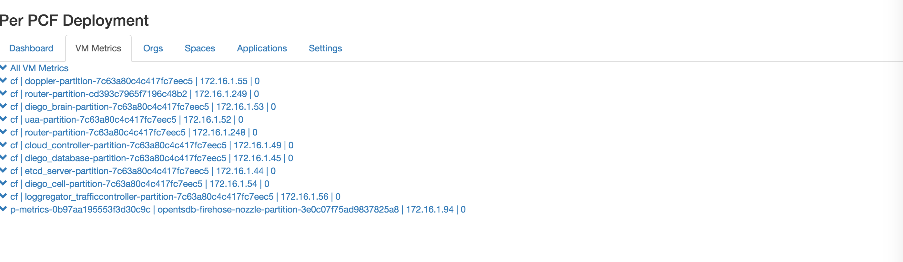
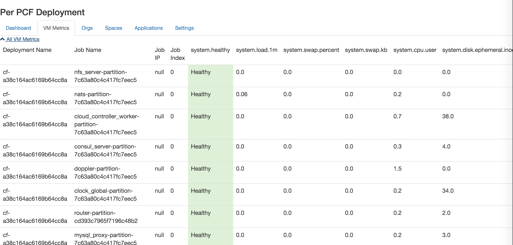
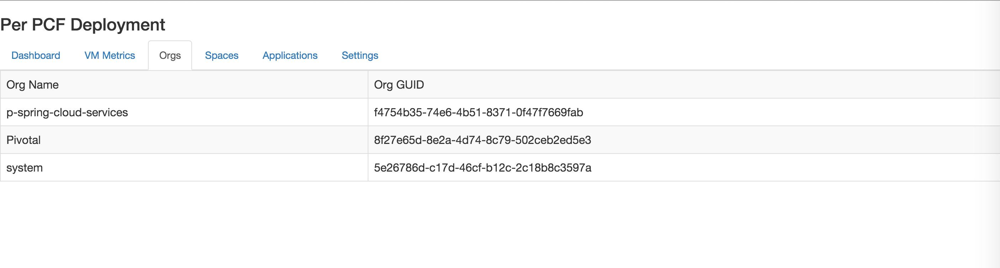
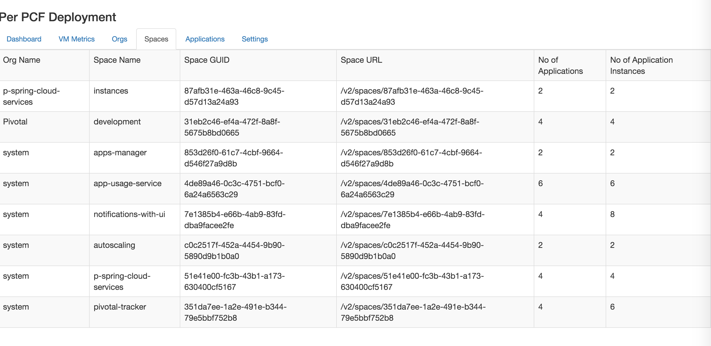
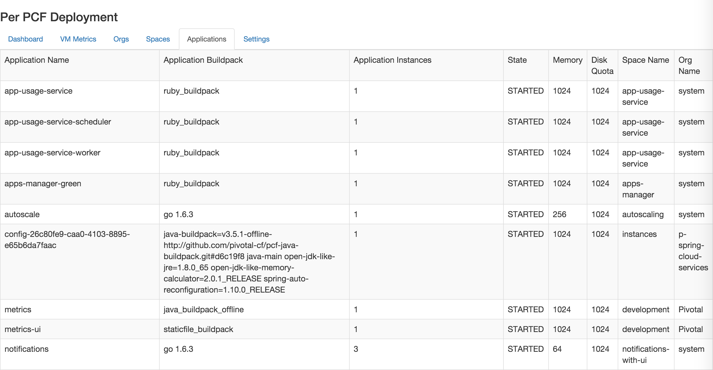
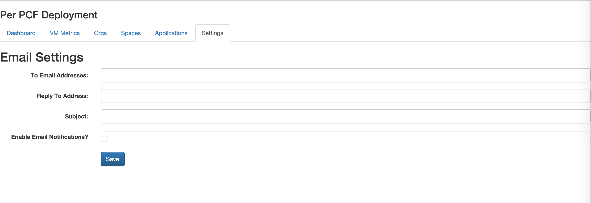

---
Metrics UI
---

Frontend application to display the PCF foundation metrics

- Edit the `/js/metrics.js` file and update the variable `endpoint` to point to the metrics rest endpoint
- Use the following manifest to push the application to cloud foundry
```
---
applications:
- name: metrics-ui
  memory: 1024M
  path: ../metrics-ui/
  buildpack: staticfile_buildpack
```
- Target to the dedicated org/space for these utils
- `cf push` to your foundation

## Overall Dashboard


## Ops Metrics Details and OpenTSDB details for jobs


## You can view the health of the jobs


## View All Orgs


## View All Spaces


## View All Applications


## Configure your email settings

